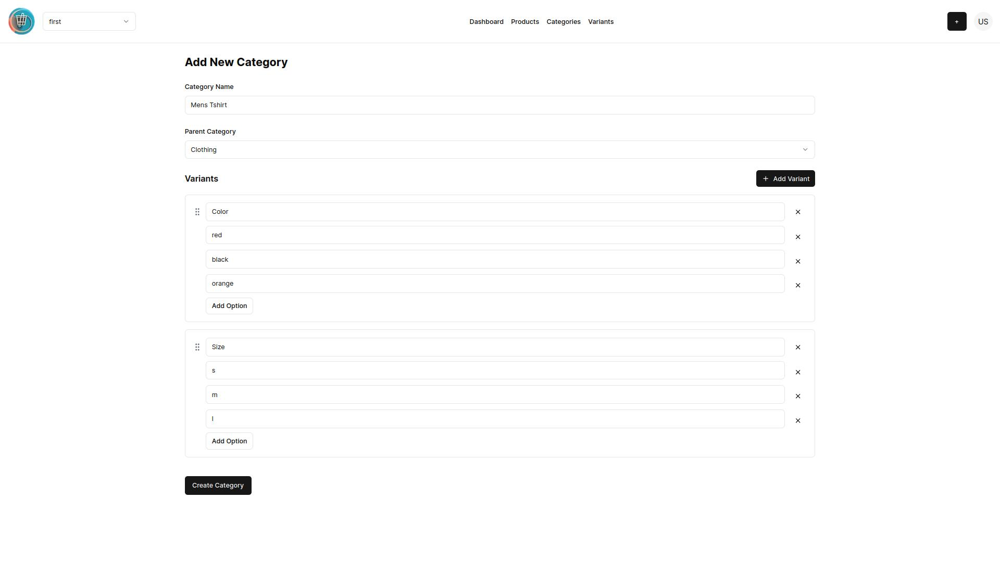
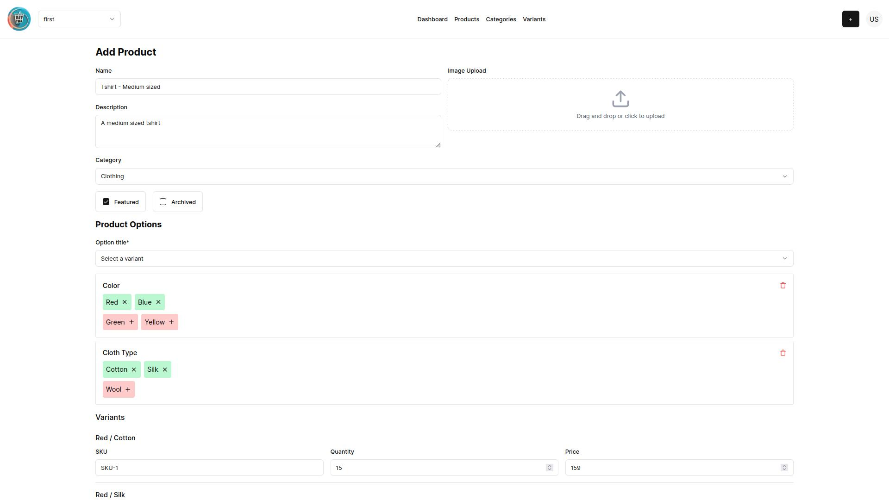

# ECMS Admin Panel

ECMS Admin Panel is a modern, user-friendly interface for managing e-commerce operations. This project serves as the frontend for the E-Commerce Management System (ECMS) backend, providing a seamless experience for store administrators to manage their products, categories, and variants.

## Live Demo

Visit [https://dhukan.vercel.app](https://dhukan.vercel.app) to see the application in action.

## Screenshots




## Backend Repository

The backend for this project is available at [https://github.com/blanc42/ecms](https://github.com/blanc42/ecms). It's built with Go, using the Gin web framework and GORM for database operations.

## Features

- User authentication (signup and login)
- Store management
- Product management with variant support
- Category management with hierarchical structure
- Responsive design for desktop and mobile use

## Technology Stack

- Next.js 14
- React 18
- TypeScript
- Tailwind CSS
- Shadcn UI components
- Zustand for state management
- React Hook Form with Zod for form validation

## Getting Started

To run this project locally:

```
bun install
bun i -g vercel
vercel dev
```

Then open [http://localhost:3000](http://localhost:3000) with your browser to see the result.

## Project Structure

- `app/`: Next.js app router pages and layouts
- `components/`: Reusable React components
- `hooks/`: Custom React hooks
- `store/`: Zustand store configurations
- `types/`: TypeScript type definitions
- `lib/`: Utility functions and configurations

## Deployment

This project is deployed on Vercel. For more information on deploying Next.js applications, refer to the [Next.js deployment documentation](https://nextjs.org/docs/deployment).

## Contributing

Contributions are welcome! Please feel free to submit a Pull Request.

## License

This project is open source and available under the [MIT License](LICENSE).